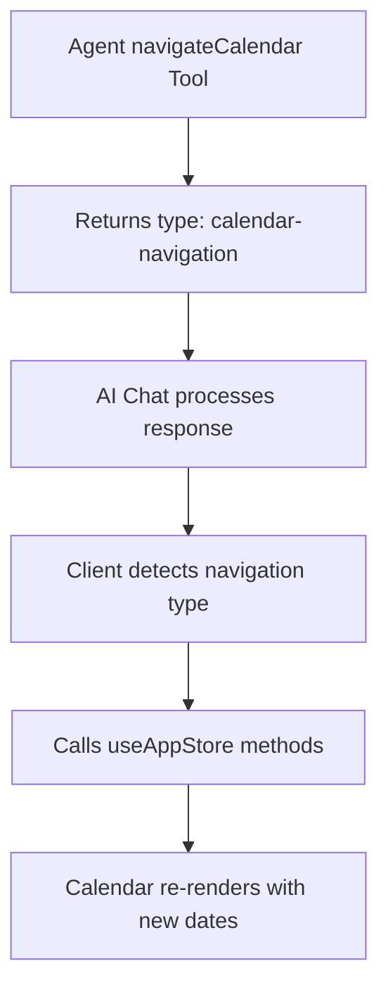

# Comprehensive Calendar Navigation Integration Plan

## 1. Current System Analysis

**Existing Navigation State Management:**
- `/Users/mbrasket/dev/calendar-mono/apps/calendar/src/store/app.ts:92` - `setConsecutiveView(type, startDate, customDayCount)`
- `/Users/mbrasket/dev/calendar-mono/apps/calendar/src/store/app.ts:102` - `toggleSelectedDate(date)` for non-consecutive
- `/Users/mbrasket/dev/calendar-mono/apps/calendar/src/store/app.ts:103` - `clearSelectedDates()`

**Existing AI Tool Pattern:**
- `/Users/mbrasket/dev/calendar-mono/apps/agent/src/mastra/tools/highlight-events.ts:22` - Returns `type: "ai-highlight"` for client processing
- Client-side handles tool responses via AI chat integration

## 2. Integration Architecture



## 3. Implementation Steps

### Step 1: Server-Side Tools
- **Regular Tool** (`apps/agent/src/mastra/tools/calendar-navigation.ts`)
  - Return `type: "calendar-navigation"` (following highlight pattern)
  - Include navigation payload with mode and dates
- **MCP Tool** (`apps/agent/src/mastra/mcp-servers/tools/calendar-navigation-mcp.ts`)
  - Same functionality for MCP server access
- **Add to exports and registrations**

### Step 2: Client-Side Response Handler
- **Location**: Where AI chat responses are processed (likely in AI assistant panel)
- **Detection**: Check for `response.type === "calendar-navigation"`
- **Actions**:
  ```typescript
  if (response.type === "calendar-navigation") {
    if (response.navigation.mode === "consecutive") {
      setConsecutiveView(
        response.navigation.consecutiveType,
        new Date(response.navigation.startDate),
        response.navigation.dayCount
      );
    } else {
      // Switch to non-consecutive mode
      set({ viewMode: 'non-consecutive' });
      clearSelectedDates();
      response.navigation.dates.forEach(date => {
        toggleSelectedDate(new Date(date));
      });
    }
  }
  ```

### Step 3: Tool Input/Output Design
- **Input**: Simple date strings and arrays
- **Output**: Structured navigation commands
- **Validation**: 14-day limits, date format validation
- **Error Handling**: Clear error messages

### Step 4: Integration Points
- **AI Chat Context**: Ensure navigation works with calendar context
- **State Synchronization**: Navigation updates calendar context for AI
- **User Feedback**: Show navigation success/error messages

## 4. Detailed File Changes

### A. Server-Side Tool (`calendar-navigation.ts`)
```typescript
return {
  success: true,
  type: "calendar-navigation" as const,
  navigation: {
    mode: 'consecutive' | 'non-consecutive',
    // Mode-specific payload
  },
  message: "Navigation description"
};
```

### B. MCP Tool (`calendar-navigation-mcp.ts`)
- Same interface as regular tool
- Add to MCP server registration

### C. Client Response Handler
- Find where AI tool responses are processed
- Add navigation-specific handler
- Call existing store methods

### D. Tool Exports
- Add to `tools/index.ts`
- Add to `mastra/index.ts` tools object
- Add MCP version to MCP server

## 5. Testing Strategy
- **Unit Tests**: Tool validation logic
- **Integration Tests**: Full navigation flow
- **Manual Tests**: AI agent navigation commands

## 6. Error Handling
- Invalid date formats
- Date range exceeds 14 days
- Network/auth failures
- Client-side state conflicts

## 7. User Experience
- **Smooth Transitions**: Calendar animates to new dates
- **Feedback Messages**: Success/error notifications
- **Context Preservation**: Maintain other UI state during navigation
- **AI Integration**: Navigation works seamlessly with AI conversations

## Status
- [x] Plan created
- [x] Server-side tool implementation
- [x] MCP tool implementation
- [x] Client-side response handler
- [x] Tool exports and registration
- [ ] Testing and validation

## Implementation Details

### Server-Side Tool
- **File**: `apps/agent/src/mastra/tools/calendar-navigation.ts`
- **Pattern**: Follows highlight tool pattern with `type: "calendar-navigation"`
- **Validation**: 14-day limits, date format validation
- **Output**: Structured navigation payload for client processing

### MCP Tool
- **File**: `apps/agent/src/mastra/mcp-servers/tools/calendar-navigation-mcp.ts`
- **Registration**: Added to `calendarUserSettings` MCP server
- **Interface**: Same as regular tool for consistency

### Client Handler
- **File**: `apps/calendar/src/components/ai-assistant-panel.tsx:327`
- **Location**: `onToolCall` handler alongside highlight tools
- **Actions**: Calls `setConsecutiveView()` and `toggleSelectedDate()` from useAppStore
- **Error Handling**: Comprehensive try/catch with tool result feedback

### Tool Registration
- **Regular Tool**: Added to `tools/index.ts` and `mastra/index.ts`
- **MCP Tool**: Added to MCP server tools object
- **Verified**: Both imports and registrations confirmed

## Ready for Testing
The navigation tool is now fully integrated and ready for AI agent use!